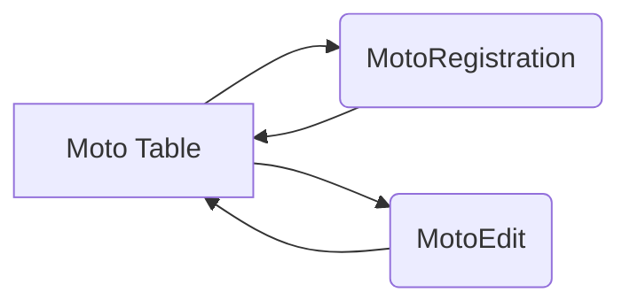

## Informações básicas (Leitura Opcional)

1. Esse projeto foi desenvolvimento em um pouco menos de dois dias.
2. O Desenvolvimento foi dividido em dois dias: 
   - 1º Dia: Criação e implementação do visual e funções gerais.
   - 2º Dia: Limpeza do código e desenvolvimento, adição de extras e correção do layout responsivo.
3. Esse projeto tem como intuito desenvolver, desafiar e por em prova meu conhecimento em front-end.
4. Escolhido a nomeação em "PT-BR" das páginas pensado na utilização de um possível cliente que leria um link, por exemplo.
5. Em Desktop, é utilizado as dimensões do projeto em figma! Por exemplo a dimensão dos cards: 1408x138 
6. A responsividade foi desenvolvida para: 
   - 1º 1920px --- 690px (Obs: Em 850px, ocorre a primeira adapatação)
   - 2º 500px --- 420px
   - 3º 420px --- 370px

- Vídeo demonstração do projeto: https://www.youtube.com/watch?v=hxMAuitgrEg
- Vídeo demonstração da responsividade: https://www.youtube.com/watch?v=B8xUiWAWKEY

7. Este repositório no GitHub já possui 17 cloners únicos. Peço aos usuários que, ao utilizarem partes do código, mencionem sua origem/escritor! 

## Páginas:  

1. http://localhost:XXXX/ --- Tabela de Motos
2. http://localhost:XXXX/registro --- Registro de Motos
3. http://localhost:XXXX/editar/id --- Editar/Edição de Motos

## Principais tecnologias:

1. React - Biblioteca JavaScript para construção de interfaces de usuário dinâmicas e componentes reutilizáveis.
2. Styled Components - Biblioteca para estilização de componentes React com CSS-in-JS, proporcionando escopo local e dinamismo.
3. Axios - Biblioteca de requisições HTTP baseada em Promises, simplificando chamadas API e tratamento de respostas.
4. JSON Server - Ferramenta para criar uma API RESTful "fake" rapidamente para prototipagem e desenvolvimento frontend sem backend real.

## Como executar em desenvolvimento:

1. Clone este repositório:

```
git clone https://github.com/igortamuz/teste-motocaSystems-frontEnd.git
```

2. Instale todas as dependências:

```bash
npm  i
```

3. Quando estiver na pasta: `teste-motocaSystems-frontEnd`, Rode o JSON server:
```bash
json-server  --watch  src/db.json  --port  3001
```

4. Em outro terminal, rode a aplicação React:

```bash
npm  start
```

##  Informações do DB.js:

1. Formato do `JSON` utilizado para realizar o `CRUD`:

```
{
"code": "78571",
"name": "MIDNIGHT MOTO",
"color": "PRETO",
"price": "31.700,00",
"status": "Em trânsito",
"id": "u1v2"
}
```

## Direcionamento

As rotas se iniciam em MotoTable("/"), por onde podem ir a MotoRegistration("/registro"), para registrar uma moto, ou MotoEdit("/editar/:id"), para editar uma moto já registrada! Ao fim, o usuário poderá retornar a MotoTable("/") para rever suas alterações!
Obs: O acesso forçado em MotoEdit("/editar/:id"), resultará na devolução do usuário para MotoTable("/").


